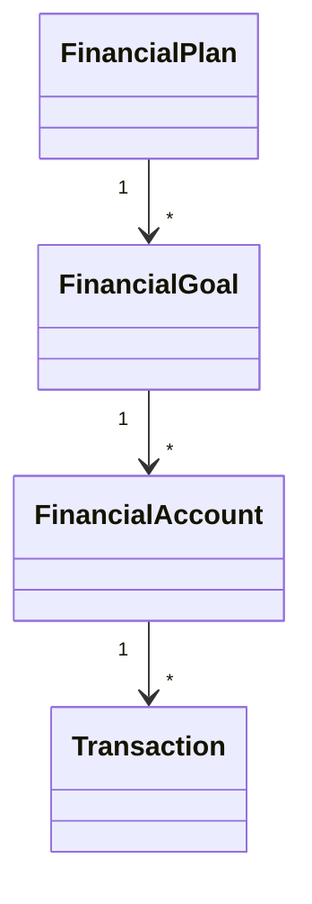

# Domain Model v1

Este documento representa el modelo conceptual del dominio de LifeOS.

No representa la base de datos.

No representa la implementación.

Representa únicamente los conceptos del negocio y sus relaciones.

---

